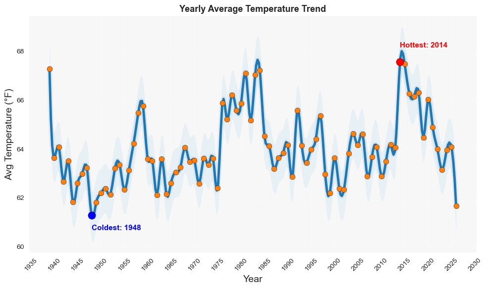
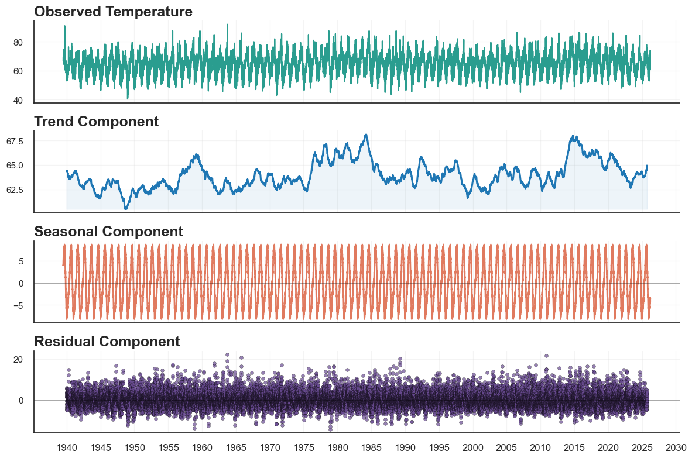
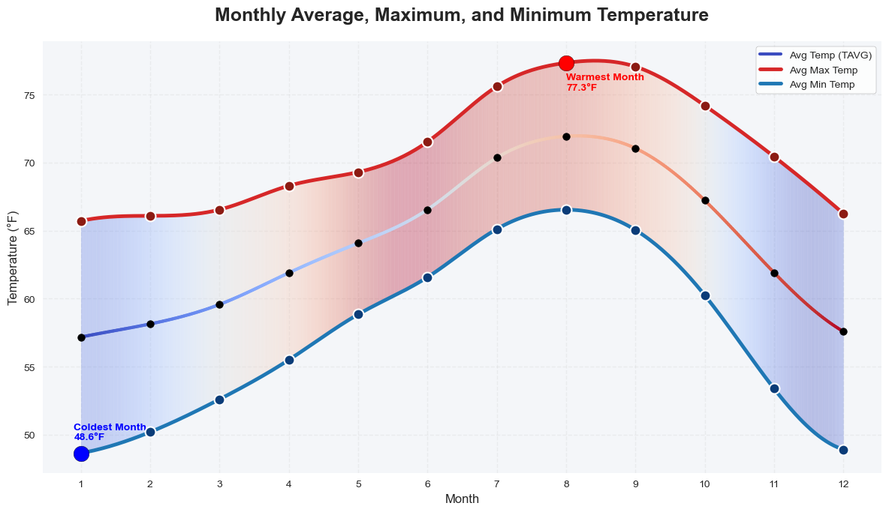
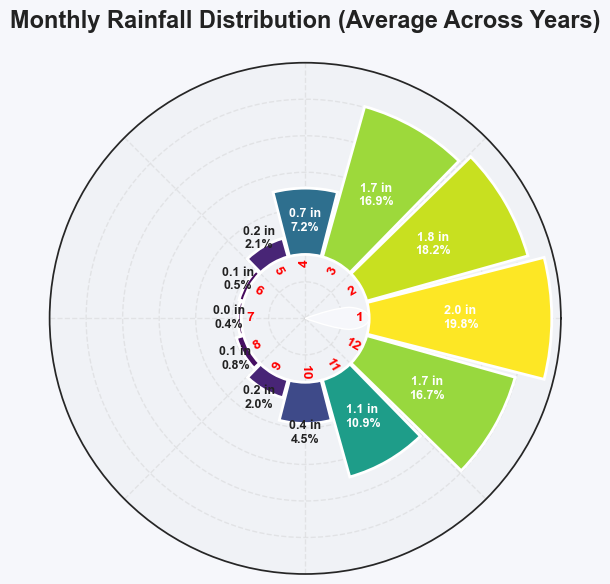
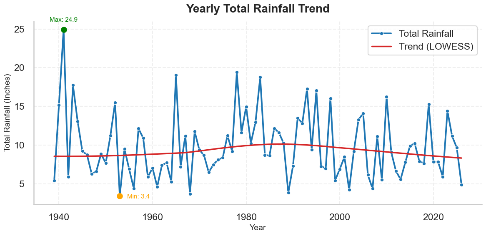
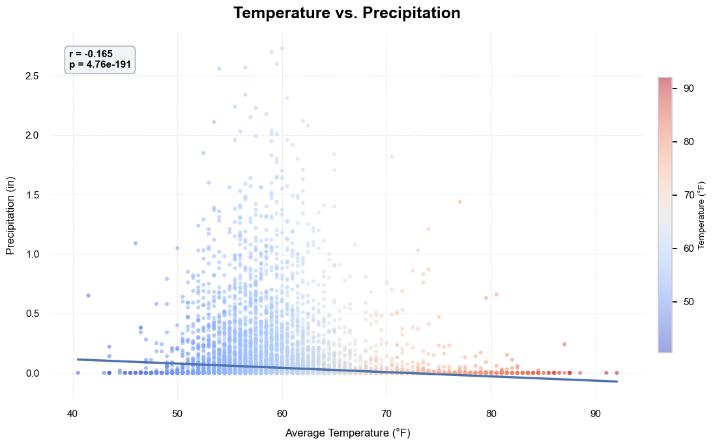
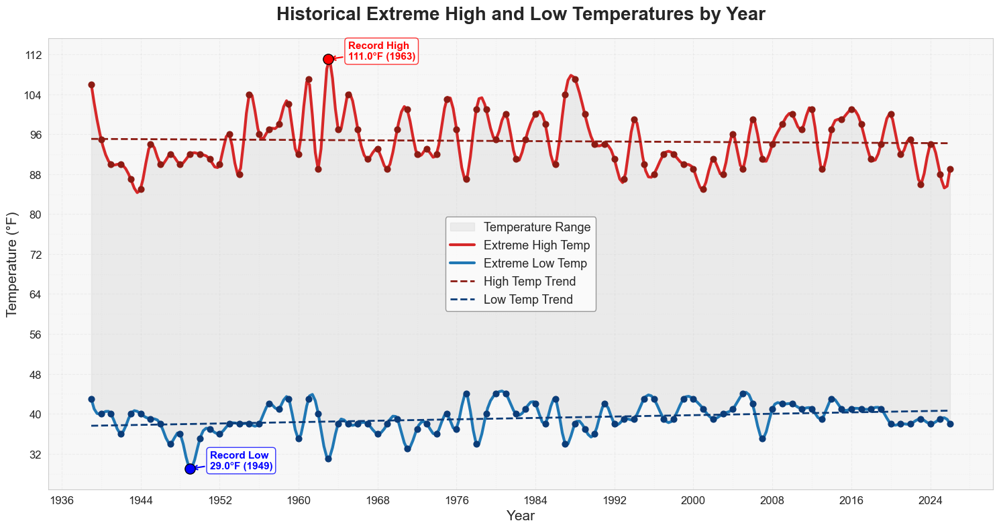
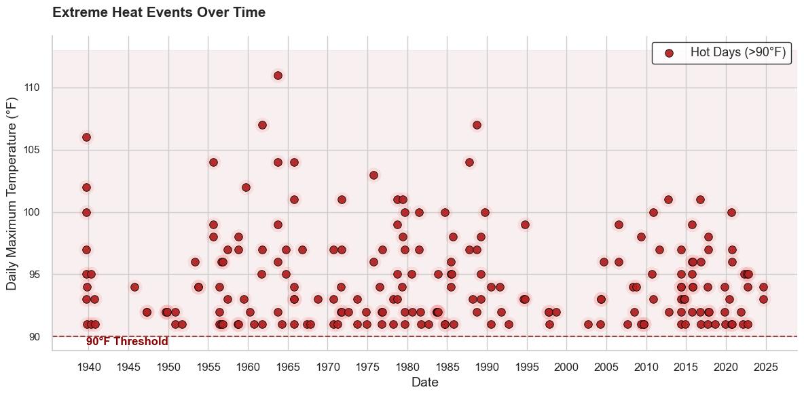

# 🌤️ San Diego Weather Analysis

## 📌 Project Overview
This project analyzes over 70 years of historical weather data in San Diego to understand long-term climate behavior, seasonal patterns, precipitation dynamics, and extreme weather events. The study combines statistical analysis and data visualization to reveal how temperature and rainfall have evolved over time.

---

## 🎯 Objectives
The main goals of this project are to:
- Explore long-term temperature trends and stability
- Identify seasonal patterns in temperature and precipitation
- Analyze the distribution of daily weather conditions
- Investigate the relationship between temperature and rainfall
- Examine changes in extreme weather events over time

---

## 📊 Dataset Description
The dataset contains daily weather observations including temperature, precipitation, and snow-related variables.

| Variable | Description |
|----------|-------------|
| Date | Observation date (YYYY-MM-DD) |
| TAVG (°F) | Daily average temperature |
| TMAX (°F) | Daily maximum temperature |
| TMIN (°F) | Daily minimum temperature |
| PRCP (Inches) | Daily precipitation |
| SNOW (Inches) | Daily snowfall (not used in final analysis) |
| SNWD (Inches) | Snow depth (not used in final analysis) |

---

## 🔍 Key Findings

### 🌡️ Temperature Trends
- Temperatures remain stable over time with no strong long-term warming or cooling trend.
-  Yearly Average Temperature Trend: 
- Seasonal cycles are clearly defined: 
  - Coldest months: January & December (~57°F)
  - Warmest month: August (~72°F)
- Most daily temperatures fall between **55°F and 75°F**, indicating a mild climate.

---

### 🌧️ Precipitation Patterns
- Rainfall is highly seasonal:
  - Wet season: December – March (peak ~170 mm in January)
  - Dry season: May – September (near zero rainfall)
- Most precipitation events are light to moderate.
- Heavy rain and dry days occur less frequently.
- annual precipitation from about 1938 to 2026 with a LOWESS-smoothed trend line. Rainfall varies significantly year to year, with early extreme highs and lows. Overall, the long-term trend rises slightly until the mid-1980s and then gradually declines back toward earlier levels, with more stable values in recent years around 8–10 inches.
- 
---

### 🌡️ Temperature vs Precipitation
- Weak negative correlation (**r = -0.165**) between temperature and precipitation.
- Higher temperatures slightly correspond to lower rainfall.
- Temperature alone is not a strong predictor of precipitation.


---

### 🌡️ Extreme Weather Events
- Record extremes remain stable:
  - High: 111°F
  - Low: 29°F
- Minimum temperatures are gradually increasing over time.
- Hot days (>90°F) are becoming more frequent in recent decades.
- 
- It shows extreme heat days (>90°F) from 1940–2025. While the highest peaks occurred earlier, recent decades show more frequent and consistent high-heat days.

  
---

## 📈 Key Insights
- Climate is **stable and strongly seasonal**
- Precipitation is **highly concentrated in winter months**
- Relationship between temperature and rainfall is **weak**
- Subtle signs of warming appear through:
  - Rising minimum temperatures
  - Increasing frequency of hot days

---

## 🛠️ Tools & Libraries
- Python
- Pandas
- NumPy
- Matplotlib.pyplot
- Matplotlib.dates
- Matplotlib.ticker
- Seaborn
- SciPy
- Statsmodels.tsa.seasonal

---

## 📌 Conclusion
San Diego exhibits a consistent and temperate climate characterized by strong seasonality, limited precipitation, and minimal long-term variability in average temperature. While overall conditions remain stable, there are emerging signals of warming reflected in increased heat event frequency and rising minimum temperatures.

---


---

## 👤 Author

**Ares Xing**  
Master’s graduate in Data Science with strong training in statistical modeling, machine learning, and data-driven analysis.  
Also brings 10 years of professional experience in intellectual property (IP) law, providing a multidisciplinary perspective that combines analytical rigor with real-world legal and policy insight.

This project applies data science techniques to explore long-term climate patterns using historical weather data, with a focus on statistical analysis, visualization, and climate trend interpretation.

## How to Run This Project

1. Clone the repository:
```bash
git clone https://github.com/your-username/your-repo.git
cd your-repo
pip install -r requirements.txt
Launch Jupyter Notebook
